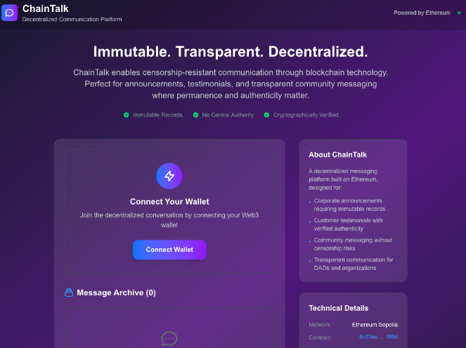

# ChainTalk Frontend

<div align="center">



<h3>🔗 Decentralized Communication Platform</h3>

[](https://chaintalk.vercel.app)
[](https://nextjs.org)
[](https://vercel.com)
[](https://ethereum.org)

[](https://hardhat.org)
[](https://openzeppelin.com)
[](https://sepolia.etherscan.io/address/0x23ea9d4aC270A0be9E8035bdb9a5c24f8Ff3499d)

---

</div>

This is a **full-stack Web3 application** demonstrating complete blockchain development capabilities. Built with **Solidity smart contracts** using **Hardhat** development environment and **OpenZeppelin** security standards, paired with a modern **Next.js** frontend deployed on **Vercel's serverless infrastructure**. ChainTalk showcases end-to-end decentralized application development from smart contract architecture to production-ready user interfaces.

## Features

- **Web3 Wallet Integration**: Connect with MetaMask and other Web3 wallets
- **Network Management**: Automatic detection and switching to Sepolia testnet
- **Real-time Blockchain Interaction**: Send and retrieve messages from the blockchain
- **Responsive Design**: Modern UI that works on desktop and mobile devices
- **Message Archive**: View all messages stored on the blockchain with timestamps and author addresses

## Technology Stack

- **Framework**: Next.js 14 with App Router
- **Language**: TypeScript
- **Styling**: Tailwind CSS
- **Web3 Integration**: ethers.js v6
- **Font Optimization**: Next.js font optimization with Geist font family

## Getting Started

### Prerequisites

- Node.js (v18 or higher)
- MetaMask browser extension
- Sepolia testnet ETH for gas fees

### Installation

1. Navigate to the frontend directory:
   ```bash
   cd frontend
   ```

2. Install dependencies:
   ```bash
   npm install
   ```

3. Start the development server:
   ```bash
   npm run dev
   ```

4. Open [http://localhost:3000](http://localhost:3000) with your browser to see the application.

## Usage

1. **Connect Wallet**: Click "Connect Wallet" to connect your MetaMask wallet
2. **Network Check**: The app will automatically prompt you to switch to Sepolia testnet if needed
3. **Send Messages**: Once connected to the correct network, you can send messages to the blockchain
4. **View Archive**: Browse all messages in the immutable message archive

## Project Structure

```
frontend/
├── app/
│   ├── globals.css          # Global styles with Tailwind CSS
│   ├── layout.tsx           # Root layout with metadata
│   └── page.tsx             # Main ChainTalk application
├── public/                  # Static assets
└── package.json            # Dependencies and scripts
```

## Smart Contract Integration

The frontend connects to the ChainTalk smart contract deployed on Ethereum Sepolia testnet:

- **Contract Address**: `0x23ea9d4aC270A0be9E8035bdb9a5c24f8Ff3499d`
- **Network**: Sepolia Testnet (Chain ID: 0xaa36a7)
- **ABI**: Included in the page.tsx file for direct integration

## Key Components

- **Wallet Connection**: Handles MetaMask connection and account management
- **Network Detection**: Automatically detects and switches networks
- **Message Sending**: Interface for composing and broadcasting messages to blockchain
- **Message Display**: Shows all messages with author, timestamp, and content
- **Error Handling**: Comprehensive error handling for Web3 interactions

## Development

You can start editing the page by modifying `app/page.tsx`. The page auto-updates as you edit the file.

### Available Scripts

- `npm run dev` - Start development server
- `npm run build` - Build for production
- `npm run start` - Start production server
- `npm run lint` - Run ESLint

## Environment Setup

For local development, ensure you have:

1. MetaMask installed and configured
2. Sepolia testnet added to MetaMask
3. Sepolia ETH in your wallet for gas fees
4. The smart contract deployed and accessible

## Getting Sepolia ETH

To interact with the ChainTalk application, you'll need Sepolia testnet ETH for gas fees. You can obtain free Sepolia ETH from:

- **Google Cloud Web3 Faucet**: [https://cloud.google.com/application/web3/faucet](https://cloud.google.com/application/web3/faucet) - Google's official Web3 faucet for testnet tokens
- **Alchemy Sepolia Faucet**: Available through Alchemy dashboard
- **ChainLink Faucet**: Alternative faucet option for Sepolia testnet

## Smart Contract Development Stack

The ChainTalk smart contract is built using industry-standard tools and frameworks:

### Development Framework
- **Hardhat**: Ethereum development environment for compiling, deploying, testing, and debugging smart contracts
- **OpenZeppelin**: Battle-tested library of secure smart contract components and utilities
- **Solidity**: Smart contract programming language

### Network Infrastructure
- **Alchemy**: Web3 infrastructure provider for reliable blockchain API access
- **Sepolia Testnet**: Ethereum's proof-of-stake testnet for development and testing
- **MetaMask**: Web3 wallet for user interaction and transaction signing

### Testing Environment
- All smart contract testing is performed on **Sepolia testnet** to ensure real blockchain conditions
- Gas optimization and security testing using Hardhat's testing framework
- Integration testing with frontend through Alchemy's RPC endpoints

## Development Workflow

1. **Smart Contract Development**: Built with Hardhat and OpenZeppelin contracts
2. **Testing**: Comprehensive testing on Sepolia testnet
3. **Deployment**: Deployed to Sepolia using Alchemy infrastructure
4. **Frontend Integration**: Connected via ethers.js and Alchemy providers


## Contributing

This frontend demonstrates modern Web3 development practices and serves as a reference for building decentralized applications with Next.js and blockchain integration. The project showcases the integration of professional development tools including Hardhat for smart contract development, OpenZeppelin for security, and Alchemy for reliable blockchain infrastructure.

